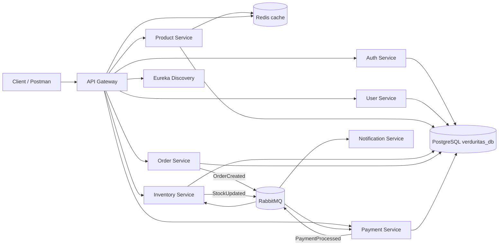

# backend---verduras

Verduritas Commerce is a production-minded e-commerce backend built with Java 21, Spring Boot and a microservices architecture. It is designed as a professional portfolio project: services are independently deployable, communicate through REST and RabbitMQ events, share one PostgreSQL database with one schema per service, and expose health checks and OpenAPI documentation.

## Architecture

The system follows Clean Architecture boundaries inside each service:

- `domain`: business concepts and enums.
- `application`: use cases, DTOs and orchestration.
- `infrastructure`: persistence, messaging, HTTP controllers and framework configuration.



## Services

- `gateway-service`: Spring Cloud Gateway, JWT resource server validation, Redis-backed rate limiting and Eureka routing.
- `discovery-service`: Eureka service registry.
- `auth-service`: registration, login, BCrypt password hashing and JWT issuing.
- `user-service`: user profile management.
- `product-service`: product catalog with Redis cache.
- `inventory-service`: stock management and stock reservation on order events.
- `order-service`: order creation and `OrderCreated` event publishing.
- `payment-service`: simulated payment processing and `PaymentProcessed` event publishing.
- `notification-service`: event-driven notification logs prepared for email/provider integration.
- `shared-events`: versioned Java records for integration events.

## Technical Decisions

- RabbitMQ was selected for event-driven workflows because the project benefits from durable queues, routing keys and simple local operation.
- A single PostgreSQL database is used for local development, with one schema per service to avoid table and Flyway migration collisions.
- Redis is used for distributed cache and gateway rate limiting.
- JWT is issued by Auth Service and validated at the Gateway with the same HMAC secret supplied by environment variable.
- Idempotency is handled in `payment-service` and `inventory-service` using `processed_events` tables keyed by event id.
- Production profile switches JPA DDL from `update` to `validate`; real production migrations should be added with Flyway or Liquibase.

## Requirements

- Java 21
- Maven 3.9+
- Docker and Docker Compose

## Run Locally

Create your local env file:

```bash
cp .env.example .env
```

Start the full ecosystem:

```bash
docker compose -f docker-compose.dev.yml --env-file .env up --build
```

Main URLs:

- API Gateway: `http://localhost:8080`
- Eureka Dashboard: `http://localhost:8761`
- RabbitMQ Management: `http://localhost:15672`
- Swagger UI per service: `http://localhost:<service-port>/swagger-ui/index.html`

## Environment Variables

| Variable | Description | Example |
| --- | --- | --- |
| `SERVER_PORT` | Service HTTP port | `8081` |
| `DB_URL` | PostgreSQL JDBC URL | `jdbc:postgresql://postgres-db:5432/verduritas_db?currentSchema=auth_service` |
| `DB_SCHEMA` | PostgreSQL schema used by Flyway and the service | `auth_service` |
| `DB_USERNAME` | Database username | `root` |
| `DB_PASSWORD` | Database password | `rroot` |
| `EUREKA_URI` | Eureka registration URL | `http://discovery-service:8761/eureka` |
| `JWT_SECRET` | 32+ character HMAC secret shared by Auth and Gateway | `replace-with-a-strong-secret` |
| `JWT_EXPIRATION_MINUTES` | JWT lifetime | `120` |
| `REDIS_HOST` | Redis hostname | `redis` |
| `RABBITMQ_HOST` | RabbitMQ hostname | `rabbitmq` |

When connecting from the host machine, PostgreSQL is exposed at `localhost:5439`. Inside Docker, services connect to `postgres-db:5432`.
| `SPRING_PROFILES_ACTIVE` | Runtime profile | `dev` or `prod` |

## Endpoint Examples

Register:

```bash
curl -X POST http://localhost:8080/api/auth/register \
  -H "Content-Type: application/json" \
  -d '{"email":"ana@example.com","password":"password123"}'
```

Login:

```bash
TOKEN=$(curl -s -X POST http://localhost:8080/api/auth/login \
  -H "Content-Type: application/json" \
  -d '{"email":"ana@example.com","password":"password123"}' | jq -r .accessToken)
```

Create a product:

```bash
curl -X POST http://localhost:8080/api/products \
  -H "Authorization: Bearer $TOKEN" \
  -H "Content-Type: application/json" \
  -d '{"name":"Organic carrots","sku":"CARROT-001","price":3.50}'
```

Set inventory:

```bash
curl -X PUT http://localhost:8080/api/inventory \
  -H "Authorization: Bearer $TOKEN" \
  -H "Content-Type: application/json" \
  -d '{"productId":"<product-id>","quantity":50}'
```

Create an order:

```bash
curl -X POST http://localhost:8080/api/orders \
  -H "Authorization: Bearer $TOKEN" \
  -H "Content-Type: application/json" \
  -d '{"userId":"<user-id>","productId":"<product-id>","quantity":2,"amount":7.00}'
```

The Postman collection is available at `postman/verduritas-commerce.postman_collection.json`.

## Testing

Run all tests:

```bash
mvn clean verify
```

The CI pipeline in `.github/workflows/ci.yml` runs the Maven build on pull requests and pushes to `main` or `master`.

## Production Notes

This project is intentionally production-ready in structure, but production deployment should add externalized secret management, database migrations, centralized tracing, container image scanning and managed RabbitMQ/PostgreSQL/Redis services.
